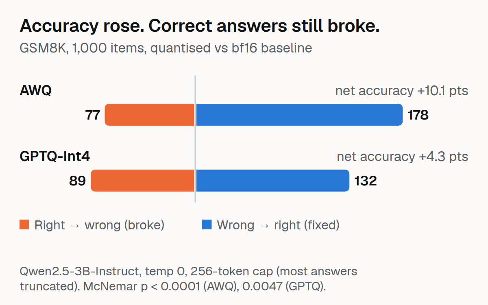

# FlipGate



Write-up: [AWQ Looked 10 Points Better on GSM8K Until I Stopped Truncating the Answers](https://dev.to/raihan-js/awq-looked-10-points-better-on-gsm8k-until-i-stopped-truncating-the-answers-18a7)

A CLI and GitHub Action release gate for quantised and re-served LLMs. Counts per-item right-to-wrong answer flips against a measured bf16 noise floor, using paired statistics (McNemar, paired bootstrap) instead of aggregate accuracy.

## Why FlipGate?

Teams usually ship a quantised model once aggregate accuracy looks unchanged. But [Dutta et al. 2024](https://arxiv.org/abs/2407.09141) showed that aggregate accuracy can hide many per-question flips. FlipGate adds:

1. **Noise floor measurement** — bf16-vs-bf16 flips under greedy decoding (temp 0): 0 for repeat runs on HF generate at a fixed batch size (on vLLM, 4 of 1,000 items changed between two repeats), and about 3% right→wrong when only the batch size changes (GSM8K, Qwen2.5-3B, 1,024-token cap)
2. **Statistical rigor** — A candidate only fails when right-to-wrong flips are significantly above the measured floor (p<0.05)
3. **Hallucination detection** — FedProc FAR/DFARS registry check (no LLM judge)

## Installation

```bash
# Create virtual environment
python -m venv .venv
source .venv/bin/activate  # Linux/Mac
# .venv\Scripts\activate  # Windows

# Install FlipGate
pip install -e ".[dev]"
```

## Quick Start

```bash
# Run tests
pytest

# Check a candidate against baseline
flipgate check --baseline bf16 --candidate awq --dataset gsm8k

# Generate noise floor report
flipgate noise-floor --model base --engine vllm
```

## Project Structure

```
flipgate/
├── src/flipgate/
│   ├── scorers/          # Rule-based scorers (GSM8K, IFEval, FedProc)
│   ├── engines/          # Inference engines (vLLM, HF, llama.cpp)
│   ├── stats/            # Statistical tests (McNemar, bootstrap)
│   ├── manifest.py       # Frozen eval manifest loader
│   ├── store.py          # Per-item JSONL results store
│   └── cli.py            # CLI interface
├── tests/                # pytest tests
├── configs/
│   └── manifest.yaml     # Frozen eval manifest
└── data/
    ├── eval/             # Evaluation datasets
    └── results/          # Per-item results (JSONL)
```

## Milestones

1. **Harness + frozen manifest** (4d) — ✅ In progress
2. **Noise floor** (4d) — bf16-vs-bf16 flips at batch 1/8/32
3. **Quant/serving sweep** (5d) — AWQ, GPTQ-Int4, GGUF comparison
4. **The gate** (4d) — CLI + GitHub Action
5. **Publish** (3d) — HF dataset, README demo, dev.to article

## Hardware

- **GPU**: RTX 3060 12GB
- **Model scope**: Qwen/Qwen2.5-3B-Instruct (~6.5 GB bf16)
- **Budget**: ~25-35 GPU-hours for full sweep

## Target Roles

This project demonstrates:
- LLMOps regression gates and release engineering
- Inference optimisation trade-offs (AWQ, GPTQ, GGUF; vLLM vs HF vs llama.cpp)
- Statistical rigour in evaluation (paired tests, bootstrap CIs, noise floors)
- Reproducibility and determinism of LLM inference
- CI/CD for models (GitHub Actions, MLflow)

Aimed at: Noeon Research, PayPay Card, Money Forward, Treasure AI, Citadel AI (Tokyo/Japan ML Platform roles)

## License

MIT

## Article

Read the full story: [FlipGate: Building a Statistical Release Gate for Quantised LLMs](./devto_article.md)

The article covers:
- Why accuracy isn't enough for evaluating quantised models
- How FlipGate measures noise floors and detects per-item flips
- Results from evaluating Qwen2.5-3B (bf16 vs AWQ vs GPTQ-Int4)
- Challenges we hit (vLLM CUDA issues, statistical power limits)
- Why this matters for LLMOps teams

## Results Summary

### GSM8K (1,000 items, HF generate, 1,024-token cap, 0% truncated; re-run 2026-10-05)

| Model | Accuracy | Δ vs bf16 | Items |
|-------|----------|-----------|-------|
| bf16 (baseline) | 79.7% (797/1000) | — | 1000 |
| AWQ (4-bit) | 76.2% (762/1000) | **−3.5 pts** | 1000 |
| GPTQ-Int4 | 76.0% (760/1000) | **−3.7 pts** | 1000 |

**Flip analysis (1,000 common items, robust answer extractor):**

| Comparison | Right→Wrong | Wrong→Right | R→W rate | 95% CI | McNemar p | Gate |
|------------|-------------|-------------|----------|--------|-----------|------|
| bf16 vs AWQ | 91 | 56 | 9.1% | [7.3%, 10.9%] | **0.0050** | FAIL |
| bf16 vs GPTQ-Int4 | 91 | 54 | 9.1% | [7.4%, 10.9%] | **0.0028** | FAIL |

Both quantised models lose accuracy and break 91 previously correct answers each (11% of the 797 that bf16 got right), with significantly more right-to-wrong than wrong-to-right flips; `flipgate check` fails both. Every response ended naturally (`finish_reason=stop` for 3,000 of 3,000; mean length 297 / 274 / 286 tokens for bf16 / AWQ / GPTQ), so none of this is truncation. Runs: `Qwen2.5-3B-bf16_gsm8k_v2`, `Qwen2.5-3B-AWQ_gsm8k_v2`, `Qwen2.5-3B-GPTQ-Int4_gsm8k_v2` in the published dataset; generated at batch size 1 (see below).

**The answer extractor decides the sign of the accuracy change.** The quantised models drift away from the `\boxed{}` final-answer format the bf16 model prefers (responses containing `\boxed`: bf16 57.7%, AWQ 28.3%, GPTQ 32.8%). The original strict extractor scores the same stored responses as bf16 60.0%, AWQ 63.2%, GPTQ 61.0%, i.e. AWQ *better* by 3.2 points (R→W 109, W→R 141, McNemar p = 0.050) and GPTQ unchanged (125 vs 135, p = 0.58). The robust extractor (last `\boxed{}`, then `####`, then "answer is", then the last number, thousands separators handled) is the one used above; report which extractor produced a number, and read the strict-extractor change as a formatting effect.

**Noise floor, measured on the corrected harness.** Repeating a run at a fixed batch size gives identical output on HF generate (0 flips at the 1,024-token cap; eager vLLM gave 0 flips at batch 32 and 8 in the first harness, which used a 256-token cap, but at the 1,024-token cap a repeat run at batch 32 changed 4 of 1,000 items, see the engine control below). Changing only the batch size is different: bf16 at batch size 1 vs batch size 8 (same weights, same prompts, first 200 items, 1,024-token cap) produced different text for 124 of 200 responses, yet changed correctness for only 13 (6 right→wrong, 7 wrong→right): a right→wrong floor of **3.0% [1.0%, 5.5%]**, McNemar p = 1.0 (`Qwen2.5-3B-bf16_gsm8k_v2_bs8`). A 24-prompt check shows the text-level sensitivity for all three models: 14/24 (bf16), 5/24 (AWQ) and 6/24 (GPTQ) responses differ between batch size 1 and 8. The quantised models' 9.1% right→wrong rate is three times that floor, and the interval's upper end for the floor (5.5%) is still below the lower end of theirs (7.3%). The gate's comparisons are only clean when baseline and candidate use the same batch size, so the sweeps above use batch size 1.

### What the first GSM8K run said, and why it is withdrawn

The first sweeps used `max_new_tokens=256` (the manifest said 2048; the script did not read it). Qwen2.5-3B-Instruct usually needs more than 256 tokens for chain-of-thought, so most responses were cut off: only 16.3% / 8.0% / 8.6% (bf16 / AWQ / GPTQ) contained a `\boxed{}` answer, and the "accuracy" was 33.0% / 43.1% / 37.3%, with AWQ apparently +10.1 points and 77 right-to-wrong flips. That was a measurement of "finished within 256 tokens", mostly verbosity, and its headline ("accuracy rose while answers broke") reversed once the cap was fixed. `flipgate check` now returns INVALID when more than 10% of responses were cut off in either run or the truncation rates differ by more than 5 points; the old runs are kept in the dataset with their finish information missing, so this can be re-checked. `scripts/run_gsm8k_v1_cap256.py` is the old runner.

### Harness health: `flipgate check` refuses truncated comparisons

Each stored item can carry `metadata.finish_reason` (`stop` or `length`) and `n_new_tokens`; `flipgate check` computes the share of responses that hit the generation cap in both runs and:

- exits with **INVALID** (code 2) if more than 10% of responses in either run were cut off (`--max-truncation`), or if the two runs' truncation rates differ by more than 5 points (a more verbose candidate would look worse for reasons unrelated to quality). `--allow-truncation` reports anyway.
- warns, when no finish reason was recorded, that truncation cannot be measured and (for GSM8K) how many responses contain no final-answer marker. On the original bf16 and AWQ runs this reads 84% and 92%.

`scripts/run_gsm8k.py` takes the cap from `configs/manifest.yaml` (manifest v1.1.0, `max_tokens: 1024`), batches with left padding (`--determinism-check N` compares batch size 1 against `--batch-size`), records finish reasons, and stores both the v2 score and the original v1 score.

### Engine control: HF generate vs vLLM (bf16)

Same Qwen2.5-3B-Instruct bf16 weights, prompts, chat template, 1,024-token cap, greedy decoding and scorer v2, on GSM8K-1000 (`scripts/run_gsm8k_vllm.py`; vLLM 0.30.0, eager mode, FlashAttention, RTX 3060). HF generate ran at batch size 1. Every pass is a run in the dataset (`Qwen2.5-3B-bf16-vllm_gsm8k_v2_*`, truncation 0.0–0.1%).

| Comparison (baseline → candidate) | Accuracy | Right→wrong | Wrong→right | R→W rate [95% CI] | McNemar p |
|---|---|---|---|---|---|
| HF batch 1 → vLLM batch 32 | 79.7% → 81.4% | 43 | 60 | 4.3% [3.1%, 5.8%] | 0.115 |
| HF batch 1 → vLLM batch 8 | 79.7% → 81.9% | 36 | 58 | 3.6% [2.5%, 4.8%] | 0.030 |
| vLLM batch 32, repeat run | 81.4% → 81.6% | 1 | 3 | 0.1% [0.0%, 0.3%] | 0.62 |
| vLLM batch 32 → batch 8 | 81.4% → 81.9% | 19 | 24 | 1.9% [1.1%, 2.8%] | 0.54 |

- **An engine swap alone broke 3.6–4.3% of previously correct answers** (and fixed 5.8–6.0%): 94 to 103 of 1,000 answers changed correctness while accuracy moved by about 2 points. That is less than 4-bit quantisation does on the same engine (AWQ and GPTQ: 9.1% right→wrong; the quantised lower bound, 7.3%, is above the engine upper bound, 5.8%), the opposite of the withdrawn llama.cpp rows below.
- The two engine rows share one HF baseline, so they are not independent evidence. One has p = 0.115 and the other p = 0.030 (vLLM scores higher); both are reported.
- The comparison also changes the batch size (1 vs 8 or 32), and batch size alone is worth about 2–3% right→wrong, so this is "engine plus batch size", not a pure engine effect.
- vLLM is not exactly repeatable at this cap: 4 of 1,000 items changed between two identical batch-32 runs (the earlier 0-flip result was at the 256-token cap).
- bf16 only: no quantised model was served through vLLM (the Marlin kernels did not compile here), so this says nothing about an engine-by-quantisation interaction. One model, one GPU, eager mode.

### Withdrawn: engine vs quantisation control with llama.cpp

An earlier version reported that swapping the inference engine (HF generate vs llama.cpp f16, same weights) flipped more answers (12.0% R→W) than 4-bit quantisation did (7.0%). Those rows are withdrawn: they were generated with a 256-token cap, compared against the truncated bf16 baseline, and the llama.cpp prompt used a different system message ("You are a helpful assistant.") than the HF chat template ("You are Qwen, created by Alibaba Cloud. ..."), so engine and prompt were confounded. The HF-vs-vLLM control above replaces them.

### IFEval (541 prompts, rule-checked, independent reimplementation of the 25 published rules)

| Model | Accuracy | Δ vs bf16 |
|-------|----------|-----------|
| bf16 (baseline) | 59.5% (322/541) | — |
| AWQ (4-bit) | 56.7% (307/541) | −2.8 pts |
| GPTQ-Int4 | 58.6% (317/541) | −0.9 pts |

| Comparison | Right→Wrong | Wrong→Right | R→W rate | 95% CI | McNemar p |
|------------|-------------|-------------|----------|--------|-----------|
| bf16 vs AWQ | 56 | 41 | 10.4% | [7.8%, 12.9%] | 0.155 |
| bf16 vs GPTQ-Int4 | 45 | 40 | 8.3% | [6.1%, 10.5%] | 0.664 |

### FedProc Hallucination (155 real-FAR records, registry-checked)

| Model | No-hallucination rate | Δ vs bf16 | New hallucinations | McNemar p |
|-------|----------------------|-----------|-------------------|-----------|
| bf16 (baseline) | 81.9% (127/155) | — | — | — |
| AWQ (4-bit) | 67.1% (104/155) | −14.8 pts | 34 | 0.0010 |
| GPTQ-Int4 | 74.2% (115/155) | −7.7 pts | 20 | 0.0376 |

### BFCL Function Calling (550 tasks: 400 simple + 100 exec-simple + 50 exec-multiple)

| Model | Rate | Δ vs bf16 |
|-------|------|-----------|
| bf16 (baseline) | 71.8% (395/550) | — |
| AWQ (4-bit) | 74.0% (407/550) | +2.2 pts |
| GPTQ-Int4 | 71.1% (391/550) | −0.7 pts |

| Comparison | Right→Wrong | Wrong→Right | R→W rate | 95% CI | McNemar p |
|------------|-------------|-------------|----------|--------|-----------|
| bf16 vs AWQ | 6 | 18 | 1.1% | [0.4%, 2.0%] | **0.0247** |
| bf16 vs GPTQ-Int4 | 14 | 10 | 2.5% | [1.3%, 4.0%] | 0.5403 |

## Gate Demo: Catching a Broken Candidate

A serving config change truncated generation to 32 tokens, cutting off chain-of-thought reasoning (the first GSM8K sweeps had the same failure in milder form: a 256-token cap that truncated most answers, which the gate now refuses as INVALID):

```
$ flipgate check --baseline <bf16-run> --candidate <truncated-run> --dataset gsm8k

| Baseline accuracy       | 33.3%            |
| Candidate accuracy      | 0.0%             |
| Right-to-wrong flips    | 10               |
| Wrong-to-right flips    | 0                |
| McNemar p-value         | 0.0044           |

FAIL: significant right-to-wrong flip asymmetry
```

The gate fails the candidate and writes a Markdown report listing all 10 flipped items. Try it: `PYTHONPATH=src python -m flipgate.cli check --help`.

## Dataset

All evaluation results are published: https://huggingface.co/datasets/raihan-js/flipgate-results

- 49 evaluation runs (GSM8K, IFEval, FedProc registry check, BFCL, and the vLLM engine control), 14,368 item-level records, as two flat tables (`items`, `runs`)
- Per-item prompts, responses, scores, and (for the corrected GSM8K runs) finish reasons and token counts
- A `status` column flags the superseded 256-token GSM8K runs and the withdrawn llama.cpp rows, so the harness caveat can be re-checked from the published data
